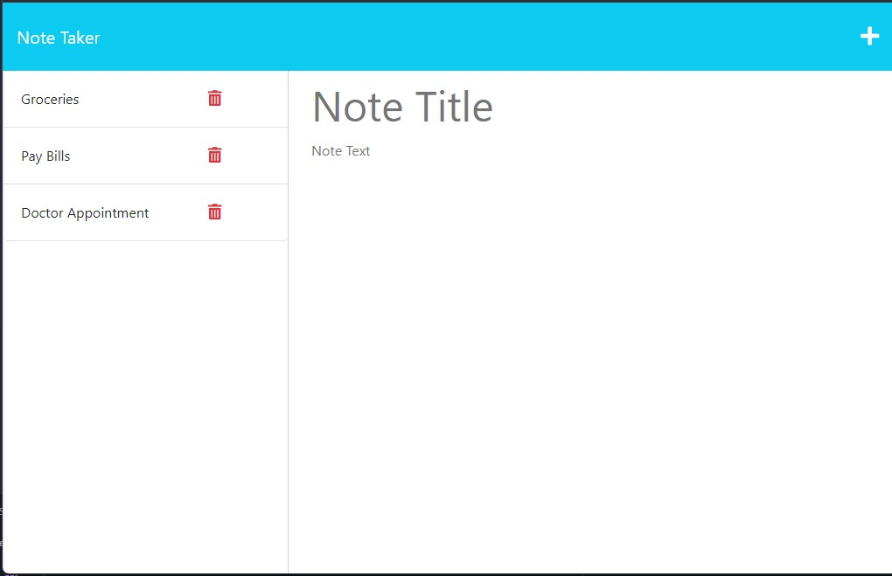

# Note Taker

## Table of Contents 
* [Description](#Description) 

* [Installation](#Installation) 

* [Usage](#Usage) 

* [License](#License) 

* [Contributing](#Contributing) 

* [Testing](#Testing) 

* [Questions](#Questions) 

### Description
Note taking program to keep track of todo items or retain notes for later use

### Installation
`npm install`

### Usage
`npm start`  
Hosted application here: <a href="https://xpress-notetaker.herokuapp.com/" target="_blank">https://xpress-notetaker.herokuapp.com/</a>

### License 
Further information regarding this specific license can be found via: https://opensource.org/license/mit/.  

### Contributing
Open <a href="https://github.com/MisterBham/express-noteTaker/issues" target="_blank">Issues</a> on the GitHub repo!

### Testing
no tests provided at this time

### Questions
Should you have any further questions, please reach the developer at: <a href="mailto:misterbham.dev@gmail.com">misterbham.dev@gmail.com</a>. 

